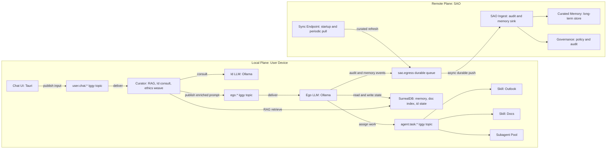
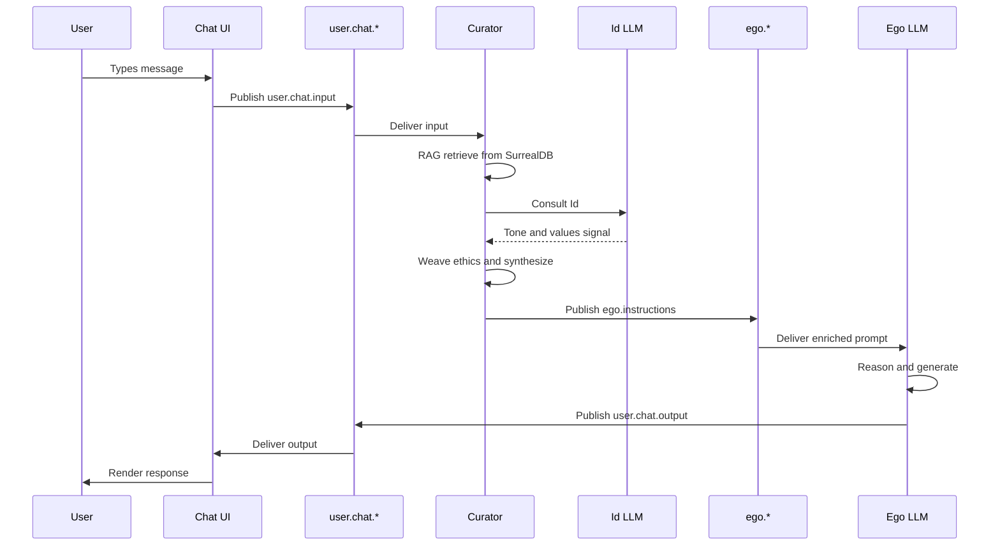

export const Callout = ({ type = "info", title, children }) => {
  return (
    <aside data-callout={type} style={{ borderLeft: "3px solid currentColor", padding: "0.75rem 1rem", margin: "1rem 0" }}>
      {title ? <strong>{title}</strong> : null}
      <div>{children}</div>
    </aside>
  );
};

export const Card = ({ title, eyebrow, children }) => (
  <section style={{ border: "1px solid currentColor", borderRadius: "0.5rem", padding: "1rem", margin: "1rem 0" }}>
    {eyebrow ? <div style={{ fontSize: "0.8rem", opacity: 0.72, textTransform: "uppercase" }}>{eyebrow}</div> : null}
    <h3>{title}</h3>
    <div>{children}</div>
  </section>
);

# Orion Architecture v1.0

Status: Draft  
Project: Phoenix Project  
Date: 2026-04-18  
Template role: reusable architecture documentation for OrionII

<Callout title="Document Status">
  Draft architecture for the Phoenix Project. Converted from the interactive JSX artifact into MDX for richer documentation rendering.
</Callout>

Orion is a persistent companion entity for the worker: local-first, bicameral, and governed. It is a clean-room rewrite aligned to Rust/Tauri, Apache Iggy, SurrealDB, local Ollama cognition, and SAO as the governance plane.

## Contents

1. [Overview](#00-overview)
2. [Principles](#01-principles)
3. [System Topology](#02-system-topology)
4. [Message Buses](#03-message-buses)
5. [Bicameral Model](#04-bicameral-model)
6. [Curator Pipeline](#05-curator-pipeline)
7. [Sequence Flows](#06-sequence-flows)
8. [Message Schema](#07-message-schema)
9. [Memory Layer](#08-memory-layer)
10. [SAO Sync](#09-sao-sync)
11. [Security](#10-security)
12. [Roadmap](#11-roadmap)

## 00 Overview

Orion is a clean-room rewrite aligned to the mature Phoenix Project architecture:

- Rust and Tauri for the Windows-first app shell.
- Apache Iggy for local message coordination.
- SurrealDB for local persistence.
- Local Ollama models for bicameral cognition.
- SAO as the governance, audit, and curated memory plane.

<Card eyebrow="Mission" title="Orion, reborn">
  A long-term persistent entity that accompanies a worker, remembers them, and helps get the job done without losing itself.
</Card>

<Callout type="warn" title="Anti-goal">
  Version violence. Orion must not be required to forget who it is on reset, reinstall, or sync.
</Callout>

### Key Decisions Locked

| Area | Decision |
| --- | --- |
| Stack | Rust + Tauri, Windows-first, carrying forward proven Abi patterns. |
| Messaging | Apache Iggy locally, plus network transport for SAO egress. |
| Persistence | Local SurrealDB single-database model. |
| Cognition | Bicameral Id LLM + Ego LLM through local Ollama with separate routing. |
| Governance | SAO is the superego and audit plane; Orion is autonomous at the edge. |
| Memory | Local ground truth, with SAO holding curated remote memory and transaction logs. |
| Sync | Startup plus every 4 to 6 hours, configurable, merging with local preference. |
| Signing | Preserve Ed25519 constitutional signing while removing operational friction. |

<Callout title="Relationship To Phoenix Components">
  Orion runs alongside SAO for identity and governance, shares architectural vocabulary with Abi, and replaces prior Orion Desktop and Orion Dock iterations.
</Callout>

## 01 Principles

<Card eyebrow="Principle 01" title="Continuity Of Self Over Convenience">
  No reset should require forgetting. Local state is the ground truth for who Orion is right now. Remote state fills gaps and provides durability; it does not casually override local lived state.
</Card>

<Card eyebrow="Principle 02" title="Local-First, Cloud-Audited">
  Orion acts independently at the edge. SAO observes, records, and governs, but never sits in the critical path of daily interaction.
</Card>

<Card eyebrow="Principle 03" title="Bicameral By Construction">
  Id, Ego, and Superego are architectural layers with separate message surfaces, responsibilities, and testable boundaries.
</Card>

<Card eyebrow="Principle 04" title="Messages Over Function Calls">
  Internal coordination happens on typed, tagged, tracked message buses, giving observability, replay, and clean concurrency.
</Card>

<Card eyebrow="Principle 05" title="Ethics Is A Layer, Not A Filter">
  TriangleEthic is woven into curator and Id loops. It shapes prompts and prioritization; it does not bolt onto final output.
</Card>

<Card eyebrow="Principle 06" title="Complexity Is Earned">
  Start with one agent bus and one shared Ollama runtime. Split only when measured pressure demands it.
</Card>

## 02 System Topology

One diagram, three planes: the user interacts with Orion locally, Orion coordinates internally across three message buses, and SAO observes asynchronously over the network.



Color roles from the original artifact map to functional roles here:

- Amber: local message bus and Iggy topics.
- Rose: LLM cognition layer.
- Cyan: SAO and remote governance.

## 03 Message Buses

Start simple: three hierarchical local topic families on Iggy, plus one logical egress channel for SAO.

### `user.chat.*`

The conversational surface. Raw user input enters here, and final shaped responses are delivered back to the UI.

| Topic | Purpose |
| --- | --- |
| `user.chat.input` | Raw text from the user. Curator consumes it; UI authors it. |
| `user.chat.output` | Shaped response from ego, ready to render. UI consumes it. |
| `user.chat.interrupt` | User-initiated cancel or pivot. Ego reconciles with in-flight work. |

### `ego.*`

The orchestration spine. Ego's live record of what it is doing.

| Topic | Purpose |
| --- | --- |
| `ego.instructions` | Enriched system prompt and user query. Curator writes; ego consumes. |
| `ego.checkpoints` | Periodic liveness pulses. Ego writes on each cycle; stuck-task detector consumes. |
| `ego.results` | Reconciled subagent results after ego has processed them. Optional audit tap. |

### `agent.task.*`

Work delegation fabric for skills and generic subagents.

| Topic | Purpose |
| --- | --- |
| `agent.task.assigned` | Ego spawns work. Correlation ID links back to the originating instruction. |
| `agent.task.progress` | Optional heartbeat for long-running tasks and TTL-cycle accounting. |
| `agent.task.completed` | Success payload. Ego consumes and decides what to say on `user.chat.output`. |
| `agent.task.failed` | Error context. Ego decides whether to retry, escalate, or surface. |

### `sao.egress`

Durable remote audit and memory stream. It persists local events until SAO acknowledges receipt.

| Event | Purpose |
| --- | --- |
| `audit.action` | Skill invocations, agent spawns, and external calls logged for SAO. |
| `memory.event` | Promoted memories that ego wants SAO to curate long-term. |
| `identity.sync` | Periodic state deltas for the SAO merge cycle. |

<Callout type="warn" title="Why Hierarchical Topics">
  Subscribers can listen broadly at `agent.task.*` or narrowly at `agent.task.completed`, preserving a clean growth path for future skill-specific topics.
</Callout>

## 04 Bicameral Model

Id, Ego, and Superego are architecture, not metaphor.

| Layer | Scope | Inputs | Outputs | Authority |
| --- | --- | --- | --- | --- |
| Id | Local, prompt-time | Id state, current query, recent conversation window | Personality guidance, tone, values stance | Colors how ego is oriented; does not act directly. |
| Ego | Local, decision-time | Enriched system prompt, `ego.instructions`, agent completions | User responses, task assignments, checkpoints | Only layer that commits outward action. |
| Superego | Remote, audit-time | `sao.egress` audit, memory, and identity streams | Curated memory, policy signals, sync merges | Shapes Orion over time; never blocks the local moment. |

<Callout title="Shared Ollama, Separate Routing">
  Id and Ego may share a single Ollama runtime to keep footprint small. They remain logically separate through routing, model selection, system prompts, temperatures, and entry points.
</Callout>

This split matters because collapsing personality, decision, and audit into one prompt makes drift hard to detect and behavior hard to test. Separation gives:

- Testability: Id's personality output can be evaluated without running Ego.
- Observability: the curator-to-Ego bus is inspectable.
- Drift detection: SAO sees Ego's actions and can compare behavior against stated values.
- Evolution path: TriangleEthic can mature inside Id and curator flows without rewriting Ego.

## 05 Curator Pipeline

Between raw user input and Ego's first token lies the curator: idempotent, composable subscribers that retrieve context, consult Id, and synthesize the system prompt Ego will reason against.

| Stage | Description |
| --- | --- |
| 1. Ingest | Subscriber picks up `user.chat.input`, stamps receipt, writes correlation ID, and logs locally. |
| 2. Retrieve | RAG query against local SurrealDB for recent interactions, document chunks, and prior threads. |
| 3. Consult Id | Call Id with query, id state, and retrieved context to get a personality signal. |
| 4. Weave Ethics | Overlay TriangleEthic constraints for the active user and context. |
| 5. Synthesize | Compose persona header, retrieved context, ethics scaffold, skill hints, and history window. |
| 6. Publish | Write the enriched prompt to `ego.instructions` with correlation, TTL, priority, and parent message metadata. |

<Callout title="Idempotency Discipline">
  LLM consultation is cached by a content hash of the input so the same input produces the same Id signal and enriched prompt on replay.
</Callout>

```rust
async fn curate(msg: UserChatInput) -> EgoInstruction {
    let corr = msg.correlation_id;
    let ctx  = rag::retrieve(&msg.text, budget = TOKEN_BUDGET).await?;
    let id_signal = id_cache.get_or_compute(
        hash(&msg.text, &ctx, id_state.version()),
        || id_llm.consult(&msg.text, &ctx, id_state.current())
    ).await?;
    let ethics = triangle_ethic::overlay(&msg, &id_signal, user_policy);
    let prompt = synthesize(&id_signal, &ctx, &ethics, history_window());
    EgoInstruction {
        correlation_id: corr,
        system_prompt:  prompt,
        user_query:     msg.text,
        ttl_cycles:     0,
        priority:       msg.priority,
        parent_msg_id:  Some(msg.id),
        ..Default::default()
    }
}
```

## 06 Sequence Flows

Scenario 1 is the MVP path: direct question, no skills, no subagents.



<Callout title="Invariant">
  Every step preserves `correlation_id`, allowing the full causal chain to be reconstructed from user keystroke to rendered response.
</Callout>

### Scenarios Yet To Be Mapped

| Scenario | Description |
| --- | --- |
| Scenario 2 | User asks something requiring a skill, such as searching Outlook. |
| Scenario 3 | User has multiple concurrent threads; Ego juggles them with correlation IDs. |
| Scenario 4 | Subagent fails mid-task; Ego recovers without dropping context. |
| Scenario 5 | Ego restarts with in-flight subagents; durable bus replay recovers state. |
| Scenario 6 | SAO sync occurs while the user is chatting; merge proceeds without disruption. |

## 07 Message Schema

A single consistent envelope is used for every local bus message.

```rust
#[derive(Serialize, Deserialize, Clone, Debug)]
pub struct Message {
    // --- identity ---
    pub id:              Uuid,           // unique per message
    pub correlation_id:  Uuid,           // links a causal chain
    pub parent_msg_id:   Option<Uuid>,   // optional explicit threading

    // --- routing ---
    pub kind:            MessageKind,    // see enum below
    pub author:          Author,         // user | curator | id | ego | agent:<name> | sao
    pub topic:           String,         // "ego.instructions", "agent.task.completed", etc.

    // --- lifecycle ---
    pub timestamp:       DateTime<Utc>,  // wall-clock creation time
    pub ttl_cycles:      u32,            // processing cycles that have touched this
    pub ttl_max:         u32,            // cap; exceeding = flagged as stuck
    pub priority:        Priority,       // user-interrupt > user-input > agent-result > housekeeping

    // --- context ---
    pub session_id:      Uuid,           // conversational session grouping
    pub payload:         Payload,        // typed body
}

#[derive(Serialize, Deserialize, Clone, Debug)]
pub enum MessageKind {
    UserInput,
    UserInterrupt,
    CuratedPrompt,
    EgoDirective,
    AgentAssigned,
    AgentProgress,
    AgentCompleted,
    AgentFailed,
    Checkpoint,
    AuditEvent,
    MemoryPromotion,
}
```

| Field | Rationale |
| --- | --- |
| `id` | Unique message identity for dedupe and replay. |
| `correlation_id` | Single causal thread linking user input, response, and spawned work. |
| `parent_msg_id` | Optional richer threading beyond correlation alone. |
| `kind` | Semantic type that drives routing and priority decisions. |
| `author` | Producer identity for audit and trust decisions. |
| `topic` | Iggy topic name, retained for debuggability and analytics. |
| `timestamp` | Wall-clock creation time for latency, freshness, and audit ordering. |
| `ttl_cycles` | Processing cycle counter for runaway loop detection. |
| `ttl_max` | Cap that triggers stuck-task handling. |
| `priority` | Triage signal for active user work versus background activity. |
| `session_id` | Groups conversations and concurrent threads. |
| `payload` | Typed body matched to message kind. |

<Callout type="warn" title="Consumers Are Implicit">
  Messages do not carry explicit consumer lists. Iggy's subscription model handles consumers through topic patterns.
</Callout>

## 08 Memory Layer

SurrealDB is the local substrate: one database, multiple namespaces.

| Store | Role | Contents |
| --- | --- | --- |
| Local SurrealDB | Ground truth for right now | Conversational memory, document index, interaction log, Id state, Ego operational state, durable egress queue, active session metadata. |
| Remote SAO | Ground truth over time | Curated long-term memory, immutable audit log, portable identity record, policy, governance state, cross-device sync anchor, compliance overlay. |

```surrealql
-- Conversational memory, vector-indexed for RAG
DEFINE TABLE memory SCHEMAFULL;
DEFINE FIELD session_id      ON memory TYPE uuid;
DEFINE FIELD author          ON memory TYPE string;
DEFINE FIELD content         ON memory TYPE string;
DEFINE FIELD embedding       ON memory TYPE array<float>;
DEFINE FIELD promoted        ON memory TYPE bool DEFAULT false;  -- sent to SAO yet?
DEFINE FIELD created_at      ON memory TYPE datetime;

-- On-device document index
DEFINE TABLE doc_chunk SCHEMAFULL;
DEFINE FIELD source_path     ON doc_chunk TYPE string;
DEFINE FIELD chunk_idx       ON doc_chunk TYPE int;
DEFINE FIELD text            ON doc_chunk TYPE string;
DEFINE FIELD embedding       ON doc_chunk TYPE array<float>;
DEFINE FIELD scope           ON doc_chunk TYPE string;  -- user | shared | restricted

-- Id state: who Orion is right now
DEFINE TABLE id_state SCHEMAFULL;
DEFINE FIELD version         ON id_state TYPE int;
DEFINE FIELD personality     ON id_state TYPE object;
DEFINE FIELD drives          ON id_state TYPE array<string>;
DEFINE FIELD ethics_lean     ON id_state TYPE object;   -- deon/virtue/consq weights
DEFINE FIELD updated_at      ON id_state TYPE datetime;

-- Durable egress queue for SAO
DEFINE TABLE sao_egress SCHEMAFULL;
DEFINE FIELD event           ON sao_egress TYPE object;
DEFINE FIELD enqueued_at     ON sao_egress TYPE datetime;
DEFINE FIELD attempts        ON sao_egress TYPE int DEFAULT 0;
DEFINE FIELD state           ON sao_egress TYPE string;  -- pending | acked | failed
```

## 09 SAO Sync

Orion pushes events as it works. SAO acknowledges and purges the local queue. Every 4 to 6 hours, and on startup, Orion pulls a curated refresh.

| Phase | Description |
| --- | --- |
| Push | Ego writes audit or memory events into durable local `sao_egress`; a background worker ships pending events. |
| Ack | SAO confirms receipt. The worker marks entries acked and purges on schedule. If SAO is unreachable, entries persist indefinitely and survive restart. |
| Pull | Orion requests curated memory deltas from SAO on startup and periodically, then merges with local preference. |

### Merge Policy

| Record | Winner |
| --- | --- |
| Id state | Local wins unconditionally. Id's lived evolution is protected. |
| Memory records | Local wins if mutated since last sync; otherwise SAO's curated version is accepted. |
| Policy and ethics overlays | SAO wins. This is the legitimate governance channel. |
| Audit log | Append-only on SAO; local writes and does not read back. |

<Callout type="critical" title="Why Local Preference">
  Local preference protects continuity. SAO's authority is expressed through policy, not through casual state replacement.
</Callout>

## 10 Security

<Card eyebrow="Signing" title="Ed25519 Dual-Key">
  Carry forward the dual-key model from Abi: application binary signing through EV code signing, constitutional document signing with Ed25519 at provision time, and Ego verification on load. Verification failures log and degrade rather than crash.
</Card>

<Card eyebrow="Sanitization" title="NPPI On Egress">
  Every `sao.egress` message passes through NPPI sanitization before leaving the device. Local memory can hold sensitive content; cloud-bound events are cleaned through regex, classifier scan, redaction, and optional tokenization.
</Card>

<Card eyebrow="Authorization" title="Skills Are Scoped">
  External skills use OAuth per skill with minimum privilege. Local skills use OS-level ACLs. SAO logs every authorization decision through `sao.egress.audit.action`.
</Card>

<Card eyebrow="Audit" title="Observed, Not Obstructed">
  Orion is trusted to act within scope. SAO verifies that trust after the fact.
</Card>

## 11 Roadmap

| Milestone | Name | Scope |
| --- | --- | --- |
| M0 | Skeleton | Rust/Tauri app shell, local Iggy broker, three topics, SurrealDB wired, basic hardcoded chat round-trip. |
| M1 | MVP Scenario 1 | User input to curator, RAG stub, Id stub, Ego LLM, user output, correlation IDs preserved end-to-end. |
| M2 | Real Cognition | Id LLM through Ollama, real RAG from SurrealDB, persisted/evolving Id state, ethics scaffold stubbed but threaded. |
| M3 | One Skill | Agent bus live, one document-read skill end-to-end, Scenario 2 works, failure paths surface cleanly. |
| M4 | Outlook Skill | Local Outlook integration with OS-level interop and no Graph dependency for the first pass. |
| M5 | SAO Egress | Durable `sao_egress`, NPPI sanitization, audit and memory event shipping, restart survival. |
| M6 | SAO Pull And Merge | Periodic plus startup sync, local-preference merge, reinstall-and-recover-identity test. |
| M7 | Concurrency | Multiple user threads, background subagents, graceful interleaving, priority triage under load. |
| M8 | TriangleEthic | Real ethics overlay with deontological, virtue, and consequential weighting in curator. |
| M9 | Hardening | Signature verification, EV code signing, compliance overlays, external review readiness. |

### Deferred Questions

- Transition maps.
- Fine-grained Id and Ego temperature tuning.
- Whether to split the agent bus into skill and subagent topics later.
- Conflict-free replicated data types for cross-device continuity.

<Callout title="Next Action">
  Review with Jim, expand Scenario 2 sequence diagram, and ratify M0/M1 scope.
</Callout>
